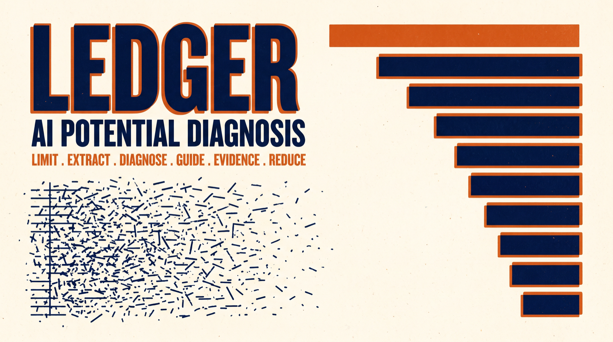

# LEDGER

**Limit · Extract · Diagnose · Guide · Evidence · Reduce**

Point an AI agent at the record you already have, and get back ten things worth knowing about yourself or your company, ranked, each with something you can do this week.

---

## What you get

One document, in this order.

**A single page at the front.** The central tension, the strength available to meet it, where you are heading, and the one action that makes most of the others unnecessary. Written last, from what survived, so it reports the findings instead of announcing a thesis. If you read nothing else, you have the thing.

**Ten findings, ranked by weight.** Weight is consequence multiplied by confidence: how much changes if this is true and you act, times how sure the evidence allows anyone to be. Heaviest first. A striking guess ranks below a plain fact.

**Each finding is four blocks, always in this order:**

> `Confidence 8/10 · Evidence broad · Basis: four periods, three domains, one real counterexample`
>
> **The finding.** One sentence saying what is true, then about a hundred words making it concrete.
>
> **What to do.** One or two actions you can start this week, in plain sentences, with the sign that would tell you it is working.
>
> **Context.** Where this sits in the wider picture, and the strongest case against it.
>
> **Sources.** Dates, counts, your own words, the specific decisions. A list you can check.

**A corpus note** stating what was actually read, what was missing, and how many candidate findings were cut to reach ten.

**A bias check and a counter-case**, where the analysis argues against itself.

## What you put in

Whatever you already have, wherever it already is. Nothing gets uploaded and nothing gets copied to a server.

Chat archives with an assistant. Commit history. CRM records. Meeting notes. Task systems. Strategy documents, goal files, invoices. Anything written for a purpose other than being analysed, carrying timestamps, recording what was actually done.

Setup is one hour, once: three short files naming your subject, your sources and your wording rules. Then every future run reuses them.

## What usually goes wrong

Prompts that analyse your history have circulated for a while. Run a few and the same four failures show up. They flatter, because a model that has read a year of your work has also learned to be agreeable about it. They bury the point under three paragraphs of framing, with the action at the bottom where a tired reader never reaches it. They hand you twenty findings, so you act on two and pick the comfortable ones. And they write the summary first, which means the evidence gets recruited to a thesis rather than producing one.

## What makes this one different

- **Your record never leaves your machine.** The agent reads sources in place. There is no upload step, no account, and no server holding your material.
- **The engine is open source, MIT.** You can read every rule it follows, change any of them, and keep pulling improvements without touching your own setup.
- **It is configured to you, not to a generic subject.** The engine ships empty. Your sources, your domains, your out-of-bounds topics and your wording rules live in three config files that stay yours and never get published.
- **It reads a person or a company.** The same six steps work on a founder, a two-person team or a business unit. A company is usually the better corpus, because more of it is written down and it contradicts itself in writing.
- **It finds what is working, not only what is broken.** Two of the twelve finding classes are the asset quietly compounding in your favour and the strength worth protecting rather than fixing.
- **Every finding says how sure it is, and argues against itself.** Confidence is committed before the entry is written. Each finding carries the strongest case against it. A reading that cannot say how it might be wrong should not be trusted with a reading of your life or your company.
- **No pathologising.** No clinical labels, about you or about anyone you mention, and a question you once asked is never treated as proof of something you did. This method diagnoses a situation, never a person. No configuration can switch that off.
- **Ten, not everything.** The cut is the product. The document reports how many candidates were dropped, so ten never reads as all there was.

## How to run it

1. Copy [`config.template/`](config.template/) to `config/` and fill in the three files. One hour, once.
2. Point your agent at [`SKILL.md`](SKILL.md) with `config/` next to it.
3. Run the six steps as separate passes, never as one prompt. The gates between them are the method. [`GUIDE.md`](GUIDE.md) walks through it.
4. Read the result in one sitting, then argue with it.

Twice a year for a person. For a company, run it just before the planning session, so it lands where decisions are made.

## The six steps

Full definitions with gates in [`SKILL.md`](SKILL.md).

| | |
|---|---|
| **Limit** | State what could actually be read and what could not, in real dates and counts. Every later claim is capped here. |
| **Extract** | Find the threads that recur across more than one period and domain, before answering anything. |
| **Diagnose** | One finding per entry, in the first sentence, specific enough to be impossible to paste into someone else's report. |
| **Guide** | One or two actions, startable this week, in sentences a tired person understands. |
| **Evidence** | Context, the strongest counter-case, then the sources. Placed after the answer on purpose. |
| **Reduce** | Rank, keep ten, then write the one page from what survived. |

## What is in this repository

| File | What it is |
|---|---|
| [`SKILL.md`](SKILL.md) | The engine. Six steps as an agent-executable skill (Claude, Codex and compatible runtimes), versioned. Carries no subject and no house voice. |
| [`config.template/`](config.template/) | The three files you fill in once: subject, corpus, voice. |
| [`GUIDE.md`](GUIDE.md) | Setup walkthrough, including how to prepare a large chat archive and how to run the steps as separate passes. |

Where the engine and your voice config disagree on wording, your config wins. Where they disagree on honesty, the engine wins.

## The honest price

It cuts things you wanted, because ten means ten. It will sometimes be wrong, which is why every finding carries a confidence number and a counter-case rather than a confident tone. And the ranking is the last decision it gets to make: which of the ten you actually act on stays yours.

---

## Provenance

This method makes no novelty claim. Prompts that read a user's history and report patterns back have circulated widely since long-context models became common.

The specific prompt that prompted this one was [kropdx/reflection-engine](https://github.com/kropdx/reflection-engine), which we ran end to end against our own archive in August 2026. Credit where it is due: the output changed three decisions for us the same day. It was also frustrating in the four ways listed above, and those four complaints are the entire design brief here.

That repository states no licence, so nothing from it has been copied: no text, no phrasing, and none of its questions. Its fixed question list is replaced here by a sweep of finding classes followed by a ranking, which is a different mechanism rather than a reworded one.

What is ours is the contract. The boundary declared before reading, the answer before its justification, the ranking to ten, the summary written last from what survived, and the two standing checks. Those checks predate the method; they come from the operating rules of the team that built it, where a bias scan and an adversarial counter-case are required before any significant analysis ships.

Built by [chim.ai](https://chim.ai), Vienna. Companion method for the writing layer: [SHAPE](https://github.com/chimai-org/shape).

## License

MIT. See [`LICENSE`](LICENSE).
